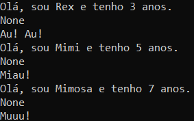
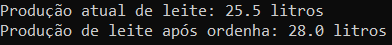

# POO_Fazenda_Ludica
Aplicar os conceitos de Classe, Objeto, Herança e Polimorfismo, além de iniciar a prática de Encapsulamento, criando um sistema simples de gerenciamento de animais em uma fazenda lúdica.


### Abstração e Classe Base (Animal)

Esta classe abstrai as características e comportamentos comuns a todos os animais da fazenda.

````python
class Animal:
    def __init__(self, nome, idade): # Construtor para inicializar os atributos
        self.nome = nome
        self.idade = idade

    def emitir_som(self): # Método genérico para retornar apenas a string "O animal emite um som." (Este método será especializado nas subclasses).
        return "O animal emite um som."
    
    def apresentar(self): # Retorna uma string no formato: "Olá, sou [nome] e tenho [idade] anos." para o animal.
        print(f"Olá, sou {self.nome} e tenho {self.idade} anos.")
````

### Herança e Especialização

Subclasses que herdam da classe Animal. Na classe Vaca, foi aplicado o encapsulamento no atributo ``producao_leite_litros``.

- ``class Cachorro(Animal):``
    - Herda todos os atributos e métodos de Animal;
    - Adiciona um novo atributo específico: ``raca`` (string);
    - **Polimorfismo:** Sobrescreve o método ``emitir_som()`` para retornar a string ``"Au! Au!"``;

````python
class Cachorro(Animal):
    def __init__(self, nome, idade, raca):
        super().__init__(nome, idade)
        self.raca = raca

    def emitir_som(self):
        return "Au! Au!"
````

- ``class Gato(Animal):``
    - Herda todos os atributos e métodos de Animal;
    - Adiciona um novo atributo específico: ``cor_pelo`` (string);
    - **Polimorfismo:** Sobrescreve o método ``emitir_som()`` para retornar a string ``"Miau!"``;

````python
class Gato(Animal):
    def __init__(self, nome, idade, cor_pelo):
        super().__init__(nome, idade)
        self.cor_pelo = cor_pelo

    def emitir_som(self):
        return "Miau!"
````

- ``class Vaca(Animal):``
    - Herda todos os atributos e métodos de Animal;
    - Adiciona um novo atributo específico: ``producao_leite_litros`` (float);
    - **Polimorfismo:** Sobrescreve o método ``emitir_som()`` para retornar a string ``"Muuu!"``;
    - Atributo modificado para ser privado;
    - Criado um método getter público chamado ``obter_producao_leite()`` que retorna o valor de ``__producao_leite_litros``;
    - Criado um método setter público chamado ``registrar_ordenha(litros)`` que permite modificar o valor de ``__producao_leite_litros`` (simulando a ordenha diária).

````python
class Vaca(Animal):
    def __init__(self, nome, idade, producao_leite_litros):
        super().__init__(nome, idade)
        self.__producao_leite_litros = producao_leite_litros

    def emitir_som(self):
        return "Muuu!"
    
    def obter_producao_leite(self): # Método getter
        return self.__producao_leite_litros
    
    def registrar_ordenha(self, litros): # Método setter
        self.__producao_leite_litros = litros
````

### Teste e Demonstração
````python
cachorro = Cachorro("Rex", 3, "Labrador") # Instanciando a classe Cachorro
gato = Gato("Mimi", 5, "Branco") # Instanciando a classe Gato
vaca = Vaca("Mimosa", 7, 25.5) # Instanciando a classe Vaca

lista_animais = [cachorro, gato, vaca] # Criando uma lista com os três objetos

for animais in lista_animais: # Laço for para imprimir as informações dos animais
    print(animais.apresentar())
    print(animais.emitir_som())
````
**OUTPUT**  


### Teste de Encapsulamento
````python
# Impressão da produção atual utilizando o método getter:
print(f"Produção atual de leite: {vaca.obter_producao_leite()} litros")

# Chamada do método registrar_ordenha() para mudar a produção de leite para 28.0 litros:
vaca.registrar_ordenha(28.0)

# Impressão da produção de leite para confirmar a mudança:
print(f"Produção de leite após ordenha: {vaca.obter_producao_leite()} litros")
````
**OUTPUT**  
